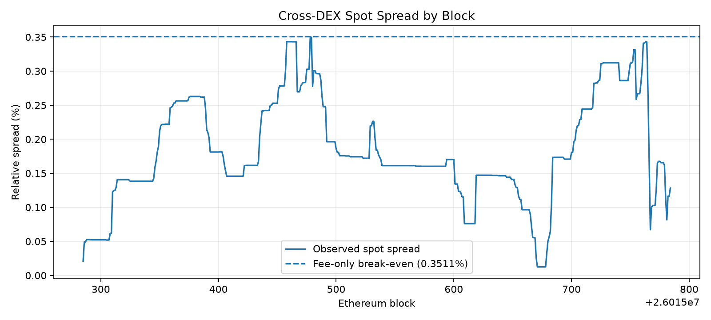
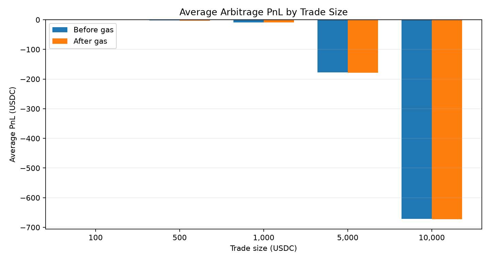

# Cross-DEX Arbitrage Analysis

## Overview

This project investigates cross-DEX arbitrage opportunities between **Uniswap V3** and **SushiSwap V2** on Ethereum using the **WETH/USDC** trading pair.

The analysis compares both decentralized exchanges at the same Ethereum block and simulates executable arbitrage trades in both directions.

Rather than treating a visible price difference as an arbitrage opportunity directly, the project evaluates whether the discrepancy remains profitable after accounting for:

- DEX trading fees
- AMM price impact
- Ethereum gas costs

The goal is to distinguish between an observable cross-DEX price discrepancy and a genuinely executable arbitrage opportunity.

---

## Research Question

**Do temporary price discrepancies between Uniswap V3 and SushiSwap create profitable cross-DEX arbitrage opportunities after transaction costs?**

The final profitability of an arbitrage trade can be expressed as:

$$
\text{Net PnL}
=
\text{Arbitrage Gain}
-
\text{DEX Fees}
-
\text{Price Impact}
-
\text{Gas Cost}
$$

A price discrepancy therefore does not necessarily imply a profitable trade. The spread must be large enough to overcome all execution costs.

---

## Methodology

The analysis uses Ethereum Mainnet on-chain state and compares both DEXs at the **same block** to avoid artificial price discrepancies caused by asynchronous observations.

The experiment focuses on the **WETH/USDC** pair.

For Uniswap V3, the analysis uses the 0.05% fee-tier pool and obtains executable swap outputs through **QuoterV2**.

For SushiSwap V2, swap outputs are calculated using the constant-product AMM model with its 0.30% trading fee.

Both possible arbitrage directions are evaluated:

```text
SushiSwap V2 -> Uniswap V3
Uniswap V3 -> SushiSwap V2
```

Five trade sizes are tested:

```text
100 USDC
500 USDC
1,000 USDC
5,000 USDC
10,000 USDC
```

The historical backtest contains:

```text
500 Ethereum blocks
2,500 trade simulations
```

For each block and trade size, the analysis calculates:

```text
Spot prices
Cross-DEX spread
Executable output on both routes
PnL before gas
Historical gas cost
Net PnL after gas
```

Gas cost is estimated using the historical block base fee together with the following assumptions:

```text
Gas usage:     300,000 gas
Priority fee:  1.0 gwei
```

The same-block WETH/USDC price is used to convert gas cost from ETH into USDC.

---

## Key Results & Findings

The 500-block historical experiment produced the following results:

| Metric | Result |
|---|---:|
| Ethereum blocks | 500 |
| Simulations | 2,500 |
| Average spot spread | 0.1832% |
| Maximum spot spread | 0.3497% |
| Fee-only break-even spread | ~0.3511% |
| Profitable simulations before gas | 0 |
| Profitable simulations after gas | 0 |
| Average gas cost | 0.831 USDC |
| Best before-gas PnL | -0.0717 USDC |
| Best after-gas PnL | -0.9048 USDC |

The observed cross-DEX spread varied substantially across blocks but remained below the approximate fee-only break-even threshold.



The maximum observed spread was approximately:

$$
0.3497\%
$$

while the theoretical spread required to cover only the 0.30% SushiSwap fee and 0.05% Uniswap V3 fee was approximately:

$$
0.3511\%
$$

This threshold still excludes price impact and gas costs.

The results therefore show that even the largest observed price discrepancy in the sample was not sufficient to create a profitable executable trade.

Trade size also had a significant effect on profitability.



Average before-gas PnL by trade size was:

| Trade Size | Average Before-Gas PnL |
|---:|---:|
| 100 USDC | -0.237 USDC |
| 500 USDC | -2.583 USDC |
| 1,000 USDC | -8.634 USDC |
| 5,000 USDC | -177.673 USDC |
| 10,000 USDC | -671.741 USDC |

The relationship reflects an important trade-off.

Smaller trades create relatively little AMM price impact, but fixed gas costs represent a larger percentage of the invested capital.

Larger trades reduce the relative importance of gas, but execution quality deteriorates rapidly because the trade consumes a larger portion of available liquidity.

The best before-gas simulation occurred with a 100 USDC trade:

```text
Block:        26015478
Spot spread:  0.349652%
Route:        Uniswap V3 -> SushiSwap V2
PnL:          -0.071679 USDC
```

The best after-gas simulation was also a 100 USDC trade:

```text
Block:        26015458
Spot spread:  0.343361%
PnL before gas:  -0.077914 USDC
Gas cost:        0.826874 USDC
Net PnL:        -0.904788 USDC
```

Overall, temporary price discrepancies between Uniswap V3 and SushiSwap V2 were clearly observable, but within this sample they were **not large enough to overcome trading fees, AMM price impact, and Ethereum gas costs**.

The results also show why a visible DEX price difference should not automatically be interpreted as an arbitrage opportunity.

Executable profitability depends not only on the spread itself, but also on liquidity depth, trade size, transaction fees, and network costs.

---

## Project Structure & Usage

```text
02-DEX_Arbitrage_Analysis/
├── config/
│   └── config.py
│
├── data/
│   ├── raw/
│   └── processed/
│
├── notebooks/
│   └── 01_arbitrage_analysis.ipynb
│
├── results/
│   ├── figures/
│   └── tables/
│
├── scripts/
│   ├── collect_snapshot.py
│   └── run_backtest.py
│
├── src/
│   ├── arbitrage.py
│   ├── backtest.py
│   ├── gas.py
│   ├── pricing.py
│   ├── rpc.py
│   └── dex/
│       ├── sushiswap.py
│       └── uniswap_v3.py
│
├── .env
├── requirements.txt
└── README.md
```

Install the required Python packages:

```bash
pip install -r requirements.txt
```

Add an Ethereum Mainnet RPC endpoint to `.env`:

```env
ETH_RPC_URL=YOUR_ETHEREUM_RPC_URL
```

Run a single-block cross-DEX snapshot:

```bash
python -m scripts.collect_snapshot
```

Run the historical multi-size backtest:

```bash
python -m scripts.run_backtest
```

The processed backtest dataset is stored under:

```text
data/processed/
```

The analysis notebook is:

```text
notebooks/01_arbitrage_analysis.ipynb
```

Running the notebook generates the research figures under:

```text
results/figures/
```

---

## Limitations

The current results should be interpreted within the scope of the experiment.

The historical sample contains only **500 Ethereum blocks**, so it represents a relatively short market window and cannot establish how frequently profitable cross-DEX arbitrage occurs over longer periods.

The analysis is limited to one pair:

```text
WETH/USDC
```

and one protocol configuration:

```text
Uniswap V3
vs
SushiSwap V2
```

Gas usage is modeled using a fixed **300,000 gas** assumption rather than measurements from a deployed atomic arbitrage smart contract.

The analysis is also performed at the block level. Arbitrage opportunities that appear and disappear within a single block are therefore not captured.

Finally, the simulation does not model several execution risks associated with production arbitrage, including:

- MEV competition
- transaction ordering
- execution latency
- reverted transactions
- changes in state before inclusion

Therefore, the absence of profitable opportunities in this 500-block sample does **not** imply that profitable cross-DEX arbitrage never occurs.

A longer historical sample and transaction-level analysis would be required to estimate the frequency, duration, and profitability of such opportunities more precisely.